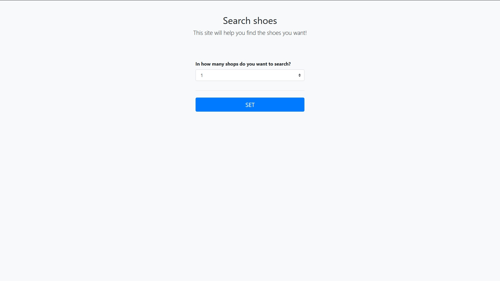
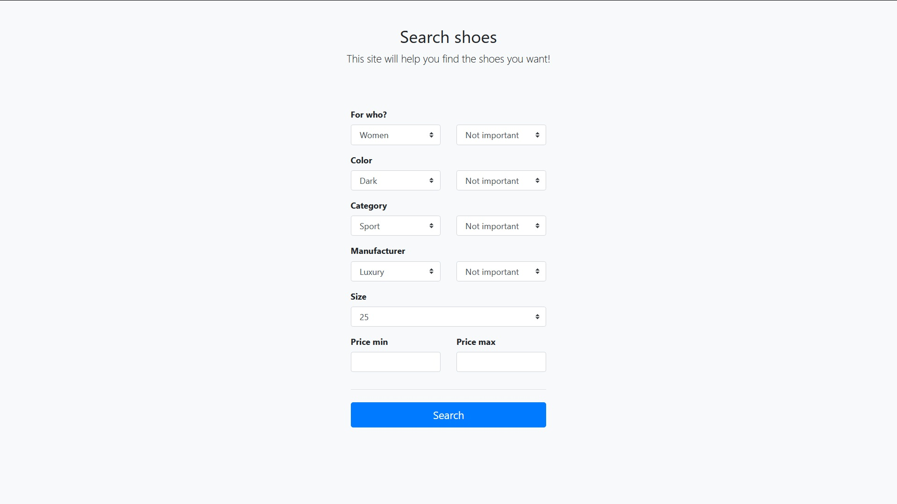
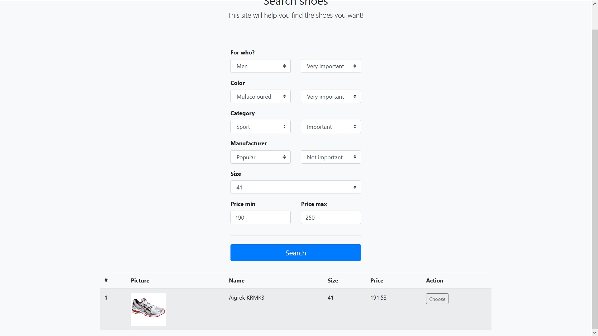

# CShoes
Application for shoe search. We send client agents to shop agents (asynchronously) in which they search for the best-fitting shoes. Then each client agent selects one pair according to our level of significance and negotiates the price until he buys or negotiations fail (then he will go to another store agent).

## Technologies
* Java 8
* Spring Boot
* Spring MVC
* Spring Data JPA
* REST API
* Hibernate 5
* PostgreSQL
* AJAX
* Bootstrap 4

## Screenshots

---

---

